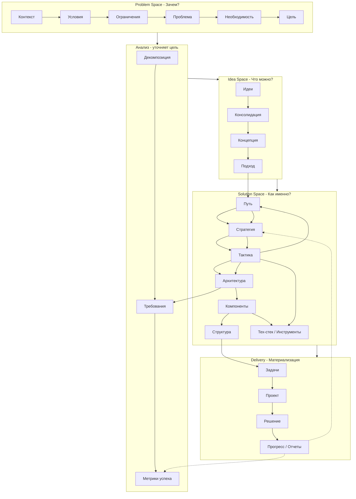

# Процесс изучения проблематики и построения проекта

```mermaid  
flowchart TD  
    %% Problem Space
    subgraph A[Problem Space - Зачем?]
        A1[Контекст] --> A2[Условия]
        A2 --> A3[Ограничения]
        A3 --> A4[Проблема]
        A4 --> A5[Необходимость]
        A5 --> A6[Цель]
    end  

    %% Анализ
    subgraph B[Анализ - уточняет цель]
        B1[Декомпозиция] --> B2[Требования]
        B2 --> B3[Метрики успеха]
    end  

    %% Idea Space
    subgraph C[Idea Space - Что можно?]
        C1[Идеи] --> C2[Консолидация]
        C2 --> C3[Концепция]
        C3 --> C4[Подход]
    end  

    %% Solution Space
    subgraph D[Solution Space - Как именно?]
        D1[Путь] --> D2[Стратегия]
        D2 --> D3[Тактика]
        D3 --> D4[Архитектура]
        D4 --> D5[Компоненты]
        D5 --> D6[Структура]
        D5 --> D7[Тех-стек / Инструменты]
    end  

    %% Delivery
    subgraph E[Delivery - Материализация]
        E1[Задачи] --> E2[Проект]
        E2 --> E3[Решение]
        E3 --> E4[Прогресс / Отчеты]
    end  

    %% Основные связи
    A --> B
    B --> C
    C --> D
    D --> E
    
    %% Дополнительные связи
    C4 --> D1
    D1 --> D2
    D2 --> D3
    D3 --> D1
    D3 --> D7
    D3 --> D4
    D4 --> B2
    D6 --> E1
    E4 -.-> B3
    E4 -.-> D2
```
